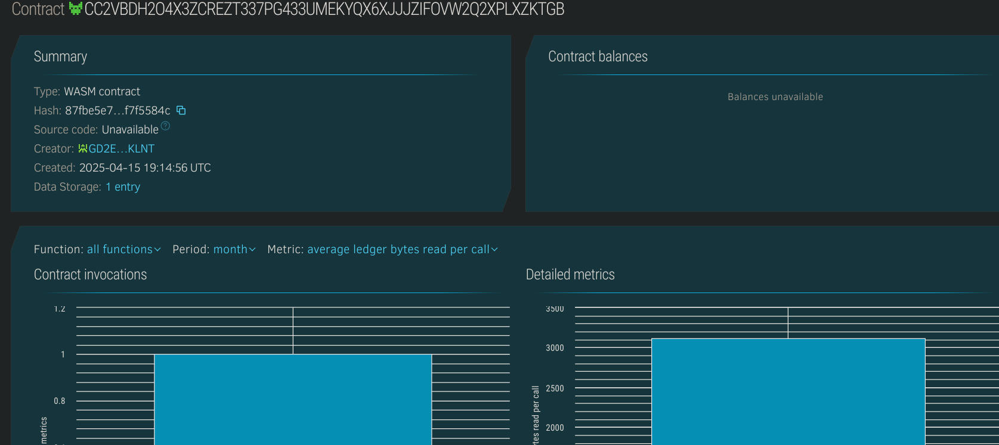

# Carbon Credit Tracker

## Project Description
**Carbon Credit Tracker** is a decentralized system that allows organizations to track their carbon credit allocations and usage in a transparent and tamper-proof manner using Soroban smart contracts on the Stellar blockchain.

## Project Vision
To promote sustainable environmental practices by offering an immutable ledger for managing carbon credit issuance and utilization. This ensures organizations stay accountable while supporting global green initiatives.

## Key Features
- 🌱 **Credit Logging**: Register earned carbon credits by organization.
- 🔄 **Credit Usage Tracking**: Deduct credits when used to maintain a real-time balance.
- 📋 **Credit History View**: Fetch detailed records using a unique ID.
- 📈 **Record Counter**: Track total credit submissions across organizations.

## Future Scope
- 🪙 Integration with token-based reward systems for eco-friendly behavior.
- ✅ Verification layer with environmental authorities.
- 📊 Real-time dashboards to visualize carbon offset data.
- 🌍 Geo-tagged emissions mapping.

## Contract Details
CC2VBDH2O4X3ZCREZT337PG433UMEKYQX6XJJJZIFOVW2Q2XPLXZKTGB

